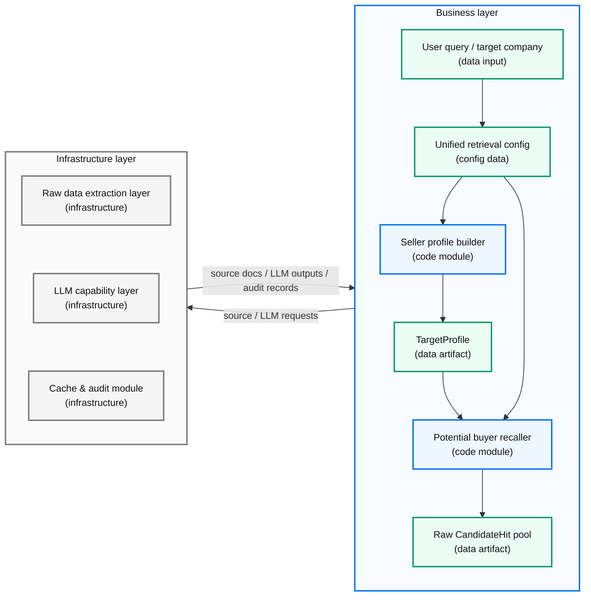
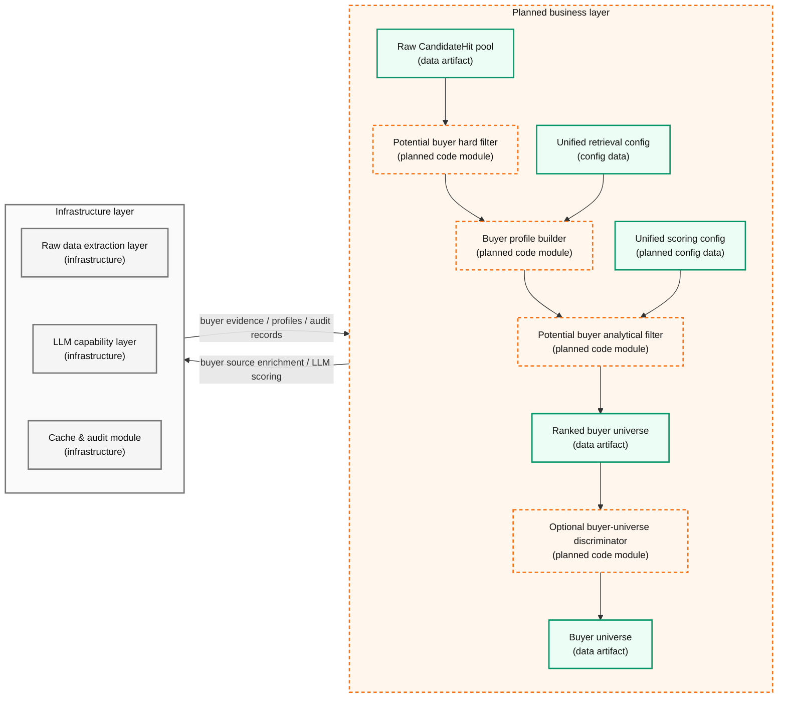

# Buyer Universe Generator

> "Start **broad**; analyze with **discipline**; stay **traceable**."

- Evidence-led buyer universe generator
- Current milestone: **seller profile** + **first-pass buyer recall**
- Presentation length: about **10 minutes**

---

# Preface

- Due to **time**, **token constraints**, and limited familiarity with the **business domain**, the current work is a **staged outcome**, not a complete **Buyer Universe Generator**.
- Although the current implementation is not yet **complete**, this presentation introduces the **full system design**.

---

# System Capabilities

- Resolve a **target company** and collect **raw source material**.
- Build a retrieval-ready **`TargetProfile`** with **evidence-backed fields**.
- Run **multi-path buyer recall**:
  - **Same-industry** public companies.
  - **Strategic buyers** with **M&A history**.
  - **Strategic buyers** with public **acquisition intent**.
  - **PE sponsors** with relevant **deal activity**.

---

# Logical Architecture: Implemented

> "Implemented modules **recall** and preserve **evidence**."

<!-- The frame handles 1/2 zoom locally after hover focus; normal wheel still pans the fixed diagram frame. -->

---

# Logical Architecture: Planned (continued)

> "Planned modules **normalize**, **filter**, and **rank**."

<!-- The frame handles 1/2 zoom locally after hover focus; normal wheel still pans the fixed diagram frame. -->

---

# Seller Profile Builder

> "The **seller profile** is the anchor for every downstream judgment."

- **Purpose**:
  - Give retrievers a shared **industry**, **product**, **customer**, and **geography** anchor.
  - Support later **hard filters** and **analytical scoring**.
- **Core fields**:
  - **Identity**: `name`, `ticker`, `cik`, `exchange`, `sic`.
  - **Business**: `business_summary`, `company_strategy`, `products`.
  - **Market context**: `customer_segments`, `channels`, `geographies`.
  - **Retrieval terms**: `keywords`, `keyword_groups`, `adjacent_categories`.
  - **Scale and proof**: `size_metrics`, `feature_labels`, `feature_evidence`.

---

# Seller Profile Sources

> "**LLMs structure evidence**; they do not replace evidence."

- **SEC EDGAR**:
  - Primary source for **identity**, **filing metadata**, **business description**, and **strategy evidence**.
- **Polygon.io**:
  - Optional **exchange** and **ticker-profile** enrichment.
- **Official company / IR pages**:
  - Optional **business-description** and **public-positioning** enrichment.
- **NewsAPI**:
  - Optional **recent-news context**.
- **LLM extraction**:
  - Produces **structured fields** from collected text; not treated as a standalone **factual source**.

---

# Potential Buyer Recaller

> "**Recall first**; precision belongs downstream."

- The recaller uses **OR logic** across multiple **retrieval paths**.
- A buyer can enter the pool if any retriever finds **defensible evidence**.
- **Caching** prevents repeated expensive retrieval work.
- Partial precision controls exist, but final **dedupe** and **filtering** are future work.
- **Traceable evidence** over opaque recommendations.
- **Child retrievers**:
  - **Same-Industry Retriever**.
  - **M&A History Retriever**.
  - **Strategic Intent Retriever**.
  - **PE Historical M&A Retriever**.

---

# Same-Industry Retriever

> "A shared **SIC** is a blunt signal, but it is a reliable starting point."

- **Retrieval target**:
  - Public **strategic buyers** in the same **SEC SIC** as the seller.
- **Method**:
  - Use **EDGAR public-company metadata** for **same-SIC discovery**.
  - Exclude **self-candidates**, unnamed candidates, and candidates without **traceable evidence**.
- **Data source**:
  - **EDGAR company metadata**:
    - Official **public-company classification**.
    - Configured through **`buyer_recall_strategic_public_companies`**.
- **Optimization**:
  - Add broader **data sources** and richer **industry taxonomies** to cover **non-U.S.-listed companies**.

---

# M&A History Retriever

> "Past **acquisitions** are not destiny, but they are strong **intent signals**."

- **Retrieval target**:
  - **Strategic buyers** with recent **same-sector** or **adjacent-sector** M&A activity.
- **Method**:
  - Generate **transaction queries** from products, keywords, customers, channels, and adjacent categories.
  - Keep only **same** or **adjacent sector** events.
  - Group repeated **deal events** by buyer and preserve structured **deal metadata**.
- **Data sources**:
  - **EDGAR**:
    - Primary source; configured around **8-K Item 2.01** with **Item 1.01** as support.
  - **NewsAPI**:
    - Supplemental **transaction-news discovery**.
  - **Google News RSS**:
    - Supplemental **RSS recall** with **LLM extraction** for **M&A classification**.

---

# Strategic Intent Retriever

> "Public **appetite** can matter before a **deal** exists."

- **Retrieval target**:
  - **Strategic buyers** that publicly signal **acquisition appetite** or **corporate-development focus**.
- **Method**:
  - Use provider-managed **LLM web search** with a strict **JSON output schema**.
  - Classify candidates as **same** or **adjacent sector**.
  - Cap **candidates**, **evidence per candidate**, documents, queries, and retry attempts.
- **Data source**:
  - **`llm_web_search`**:
    - Used for cited **public evidence**.
    - Assigned lower **evidence strength** because the pipeline does not fully control **source fetching**.
- **Optimization**:
  - Add more **data sources**, using **NewsAPI** to supplement public **strategic-intent signals**.

---

# PE Historical M&A Retriever

> "**Financial buyers** need evidence of **mandate**, not just brand recognition."

- **Retrieval target**:
  - **PE sponsors** with recent **same-sector** or **adjacent-sector** deal activity.
- **Method**:
  - Generate **industry query terms** from SIC taxonomy, target products, keywords, and adjacent categories.
  - Match acquirers against the configured **PE seed universe**.
  - Filter **old**, **unrelated**, **malformed**, and **non-seed** records.
  - Deduplicate repeated **deal records** and preserve **deal events**.
- **Data sources**:
  - **LLM web search**:
    - Primary **sponsor-activity discovery** path.
  - **Financial Modeling Prep**:
    - Secondary **M&A-record source** requiring further tuning.
  - **`pe_seed_universe.yaml`**:
    - **Identity filter** only; evidence is still required.

---

# Unified Retrieval Config Design

> "**Configuration** is where retrieval behavior becomes explainable."

- **Purpose**:
  - Keep retriever behavior **consistent**, **auditable**, and easy to tune.
- **Shared controls**:
  - Source enablement, **query budgets**, result limits, retry limits, and freshness windows.
  - Common **evidence-strength** rules and minimum citation requirements.
- **Operating principle**:
  - Prefer explicit **configuration changes** over hidden code changes when retrieval policy evolves.

---

# Future Design

> "**Filtering** should remove weak candidates without hiding the **reason**."

- **Hard filter**:
  - Remove obvious **capacity mismatches**.
  - Check buyer **scale**, **cash**, **leverage**, and minimum **evidence score** where data exists.
- **Buyer profile builder**:
  - Build comparable profiles for **retained buyers** and get ready for the analytical filter.
- **Analytical filter**:
  - Rank candidates by **strategic fit**, **historical activity**, **capacity**, and **synergy**.
  - Use **configuration-driven weights** and **thresholds**.
  - Combine **BM25-style matching**, **embeddings**, structured rules, and **LLM scoring**.
- **Buyer-universe discriminator**:
  - Challenge the ranked **buyer universe** with LLM capability.
  - Flag **coverage gaps** and candidates that need **human review**.

---

# Key Decisions

> "**Methodology** is visible in the choices the pipeline makes."

- Chose the current **pipeline design** after comparing **capacity-first recall** with the implemented **evidence-first recall** approach.
- Adopted a **unified config** to make retrieval behavior more **explainable**, **auditable**, and easier to tune.
- Defined which **data sources** each retriever should use, and how each retriever should turn source material into **candidate recall evidence**.
- Preserved **traceability** and **auditability** by keeping candidate evidence linked to source paths, citations, and source strength.
- Separated **recall**, **filtering**, **profiling**, and **scoring** so each stage has a clear responsibility and review boundary.

---

# Future Optimization

> "The next milestone is **trustworthiness** from **recall** to **ranking**."

- Tune each **retriever** for higher **recall**:
  - Parameters, **data sources**, taxonomies, and even implementation strategy.
- Tune **LLM prompts** to preserve **result quality** while staying within **budget**.
- Implement the remaining designed stages:
  - **Hard filter**, **buyer profile builder**, **analytical filter**, and **buyer-universe discriminator**.
- Engineering refactor:
  - Extract **cache & audit** as an independent layer.
  - Improve the **LLM provider interface**.
  - Split oversized **domain-layer** files into clearer modules.
  - etc.

---
layout: center
class: text-center
---

# Thanks

> "Good buyer universes are built from **evidence**, **judgment**, and **iteration**."

**Thank you.**
