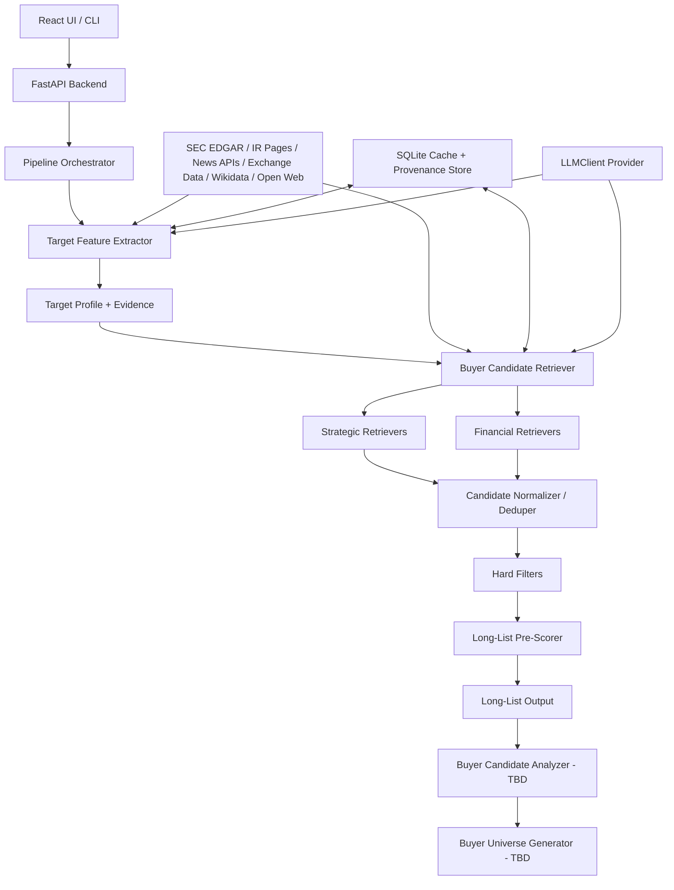

# Buyer Universe Generator Architecture Design Plan (Long-List First)

## Summary
- Goal: Given a US-listed target ticker or company name, automatically generate a traceable, explainable buyer long-list suitable for downstream analysis.
- Current focus: implement the `Target Feature Extractor` and `Buyer Candidate Retriever` to produce a high-recall candidate pool; `Buyer Candidate Analyzer` and `Buyer Universe Generator` remain as interfaces with TBD details.
- Core principles: public data only, citation first, separation of verified facts from LLM inference, multi-source retrieval, and configuration over hardcoding.
- MVP default output: 80-150 strategic buyers and 50-100 financial buyers; the downstream Analyzer will later narrow them to 30-50 defensible buyers.

## Logical Architecture

## Data Flow
1. Resolve target identity: company name or ticker -> CIK, ticker, exchange, legal name.
2. Collect target sources: SEC submissions, latest 10-K/10-Q/8-K, company/IR pages, exchange or market metadata.
3. Extract `TargetProfile`: identity, SIC/industry, business description, products, customers, channels, geography, size, keywords, adjacent categories, and feature-level citations.
4. Generate retrieval plan: same SIC, adjacent industry, product/customer/channel terms, supply-chain terms, M&A-history queries, PE-portfolio themes.
5. Run multi-path retrievers in parallel; each retriever emits `CandidateHit` with source path, evidence, confidence, and source strength.
6. Normalize and dedupe candidates by CIK/ticker/domain/name aliases; preserve all source paths and duplicate-hit counts.
7. Apply hard filters: no self-candidate, minimum relevance evidence, capacity/size fit where available, geography/public-data availability, PE portfolio or activity requirement.
8. Pre-score long-list; output structured JSON/CSV and a human-readable table.
9. Pass long-list to `Buyer Candidate Analyzer - TBD`; final ranked buyer universe generation remains `TBD`.

## Backend Module Design
- `api`: FastAPI endpoints for run creation, run status, target resolution, long-list retrieval, and exports.
- `domain`: Pydantic models for `TargetProfile`, `Evidence`, `CandidateHit`, `LongListCandidate`, `PipelineRun`.
- `pipelines`: orchestration for target extraction, candidate retrieval, normalization, filtering, and pre-scoring.
- `sources`: SEC EDGAR client, company/IR crawler, news API client, exchange/market data client, Wikidata/Wikipedia client, controlled open-web discovery.
- `retrievers`: `SameSicRetriever`, `AdjacentIndustryRetriever`, `BusinessSimilarityRetriever`, `ProductCustomerChannelRetriever`, `PeerCompanyRetriever`, `MAHistoryRetriever`, `SupplyChainRetriever`, `PEPortfolioRetriever`, `PEDealActivityRetriever`.
- `repositories`: SQLite persistence for runs, source documents, extracted features, candidate hits, evidence, and cache metadata.
- `llm`: `LLMClient + Provider` abstraction for extraction/classification only; LLM output must be marked as inference and cannot be sole evidence.
- `exporters`: JSON, CSV, and banker-readable Markdown/HTML outputs.

## Key Interfaces
- `TargetProfile`: `target_id`, `name`, `ticker`, `cik`, `sic`, `business_summary`, `products`, `customer_segments`, `channels`, `geographies`, `size_metrics`, `keywords`, `adjacent_categories`, `evidence[]`.
- `Evidence`: `claim`, `source_type`, `source_strength`, `url`, `filing_accession`, `retrieved_at`, `quote_or_snippet`, `verified_fact: bool`.
- `CandidateHit`: `candidate_name`, `buyer_type`, `retriever_name`, `source_path`, `fit_reason`, `evidence[]`, `confidence`.
- `LongListCandidate`: `canonical_name`, `buyer_type`, `ticker/cik/domain`, `source_paths[]`, `hit_count`, `initial_score`, `fit_reasons[]`, `risk_flags[]`, `evidence[]`.

## Target Feature Extractor
- Use SEC as primary source for US-listed identity, SIC, filings, business description, and financial facts.
- Use company/IR pages to enrich products, customers, channels, regions, strategy, and recent announcements.
- Use LLM for structured extraction and adjacent-category generation, but every extracted decision-driving feature must carry source evidence.
- Keep extraction minimal but useful for retrieval: do not build full investment thesis here.
- Output should explicitly distinguish `verified facts`, `derived keywords`, and `LLM-generated inferences`.

## Buyer Candidate Retriever
- Strategic retrieval paths: same SIC, adjacent industry, business similarity, product/customer/channel overlap, peer companies, M&A history, supply-chain/vertical integration.
- Financial retrieval paths: PE official portfolio fit, PE deal activity, investment criteria/size fit, platform-company add-on logic.
- Evidence rules: A = SEC/official pages/PE official pages, B = reliable news/press releases, C = Wikidata/exchange/profile data, D = broad open web discovery only.
- Inclusion rule: every formal long-list candidate needs at least one A/B evidence item; C-only goes to pending verification; D-only is excluded.
- Pre-score defaults: Strategic = fit 30%, M&A history 25%, capacity 20%, geography 10%, evidence 10%, data confidence 5%. Financial = sector focus 30%, portfolio fit 25%, deal activity 20%, size fit 15%, evidence 10%.

## Tech Selection
| Area | Choice | Reason |
| --- | --- | --- |
| Backend | Python 3.12 + FastAPI | Matches AIP/Python expectation, good API and async I/O support |
| Data models | Pydantic v2 | Strong schemas for LLM extraction, API contracts, and validation |
| Persistence | SQLite + SQLAlchemy 2.0 | Lightweight, runnable take-home storage with upgrade path |
| HTTP | httpx | Async source fetching and timeout/retry control |
| Config | pydantic-settings | Data-source toggles, thresholds, API keys, scoring weights |
| LLM | `LLMClient + Provider`, OpenRouter first | Keeps provider replaceable and inference auditable |
| Text retrieval | BM25/TF-IDF first, optional embeddings | Reliable MVP without over-depending on vector infra |
| Frontend | React 18 + TypeScript + Vite | Simple run UI and output inspection; CLI can call same API |
| Jobs | FastAPI background tasks for MVP | Enough for prototype; Celery/RQ can be added later |
| Tests | pytest + fixture-based source mocks | Deterministic tests for messy public-data behavior |
| Container | Docker Compose | One-command reviewer setup |

## Test Plan
- Target resolver handles ticker, exact company name, and ambiguous name cases.
- Feature extractor returns required fields with citations and separates facts from inference.
- Each retriever emits candidates with `retriever_name`, `source_path`, and evidence.
- Deduper merges the same buyer from multiple retrieval paths and preserves hit count.
- Hard filters exclude self, evidence-less candidates, and candidates below configured capacity/relevance thresholds.
- Scoring is deterministic for fixed fixtures and records score components.
- End-to-end smoke test runs on one selected US-listed mid-market target and exports JSON/CSV/HTML.
- Failure-mode tests cover missing filings, broken websites, empty news results, rate limits, and LLM invalid JSON.

## Assumptions / TBD
- Assumption: architecture is optimized for the take-home MVP but keeps production extension points.
- Assumption: final long-list should favor recall; precision and full banker-grade ranking move to Analyzer.
- Assumption: market cap and live exchange data can be best-effort public data; SEC facts are preferred where possible.
- TBD: detailed `Buyer Candidate Analyzer` scoring, thesis generation, and deeper evidence collection.
- TBD: final `Buyer Universe Generator` ranking, report formatting, banker review workflow, and final 30-50 buyer selection.
- Open question: PE seed universe source should be defined before implementation, because public PE coverage is fragmented.
