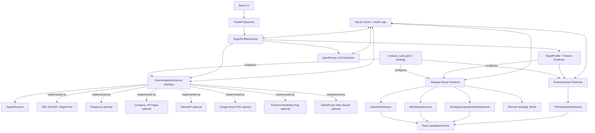
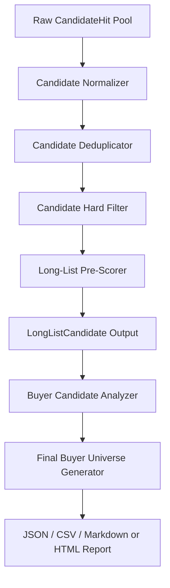

# Buyer Universe Generator Architecture Design Plan

## Summary
- Goal: given a US-listed target ticker, CIK, or exact company name, generate a traceable first-pass buyer candidate pool for downstream M&A analysis.
- Current implementation focus: target resolution, source ingestion, evidence-backed `TargetProfile` extraction, and high-recall strategic/financial buyer recall.
- Current output: raw `CandidateHit` records with source paths, evidence, warnings, and retrieval metadata.
- Not yet implemented: full candidate normalization, deduplication, hard filters, pre-scoring, final long-list promotion, final buyer-universe ranking, and export/report generation.
- Core design principles: public data only, citation first, separation of verified facts from LLM inference, multi-source retrieval, configuration over hardcoding, high extensibility, high cohesion, and low coupling.

## Current Logical Architecture



## Planned Downstream Architecture



The current code stops at the raw candidate-hit stage. `LongListCandidate` exists as a domain model, but the API does not yet emit final long-list candidates.

## Current Data Flow

1. Resolve target identity from ticker, CIK, or exact company name into canonical name, ticker, CIK, exchange, and SIC.
2. Ingest source metadata and cache source documents.
3. Fetch SEC filing metadata and preferred filing text. Current SEC form coverage includes `10-K`, `10-Q`, `8-K`, `S-1`, and `S-1/A`.
4. Optionally enrich with Polygon profile data, recent news, and official company/IR page evidence when the provider is enabled and configured.
5. Use OpenRouter LLM extraction to build a retrieval-ready `TargetProfile`.
6. Attach field-level evidence and labels: `verified_fact`, `derived_keyword`, or `llm_inference`.
7. Run strategic and financial fan-out retrievers against the `TargetProfile`.
8. Return raw `CandidateHit` objects with evidence, confidence, source paths, pending-verification flags, warnings, and retrieval metadata.
9. Cache completed target profile and buyer recall results when configured. Partial recall results with retriever failures are not persisted as valid cache entries.

## Backend Module Design

- `api`: FastAPI endpoints for health, target resolution, target profile extraction, strategic candidates, financial candidates, and combined first-pass candidates.
- `config`: runtime settings from `.env` and environment variables; source routing and retrieval behavior are kept in `retrieval_rules.yaml`.
- `domain`: Pydantic contracts for `SourceDocument`, `Evidence`, `TargetProfile`, `CandidateHit`, `DealEvent`, `StrategicRetrievalResult`, and planned `LongListCandidate`.
- `pipelines`: source ingestion, target profile extraction, factory wiring, and a thin orchestrator for first-pass candidate retrieval.
- `sources`: SEC EDGAR, Polygon, NewsAPI, Google News RSS, FMP, company pages, investor-relations discovery, and provider registry/strategy helpers.
- `retrievers.strategic`: active `SameSicRetriever`, `MAHistoryRetriever`, and `StrategicAcquisitionIntentRetriever`, plus no-op shells for planned strategic retrieval paths.
- `retrievers.financial`: active `PEDealActivityRetriever`, PE seed-universe loading, and financial fan-out.
- `repositories`: SQLite-backed source cache, target profile cache, buyer recall cache, data-source audit log, and LLM interaction log.
- `llm`: provider abstraction with OpenRouter implementation for structured extraction and web-search-assisted retrieval.
- `frontend`: React + Vite UI for running and inspecting target/profile/candidate workflows.

## Public Interfaces

- `TargetProfile`
  - Identity: `target_id`, `name`, `ticker`, `cik`, `exchange`, `sic`
  - Business profile: `business_summary`, `company_strategy`, `products`, `customer_segments`, `channels`, `geographies`
  - Retrieval features: `size_metrics`, `keywords`, `keyword_groups`, `adjacent_categories`
  - Evidence: `feature_labels`, `feature_evidence`, `evidence`

- `Evidence`
  - `claim`, `source_type`, `source_dimension`, `source_strength`, `url`, `filing_accession`, `retrieved_at`, `quote_or_snippet`, `verified_fact`
  - Every evidence record must be traceable to either a URL or a SEC filing accession.

- `CandidateHit`
  - `candidate_name`, `candidate_ticker`, `candidate_cik`, `candidate_domain`
  - `buyer_type`, `retriever_name`, `source_path`, `data_source`, `fit_reason`
  - `evidence`, `confidence`, `pending_verification`, `retrieval_metadata`
  - A hit must either contain evidence or be explicitly marked as pending verification.

- `StrategicRetrievalResult`
  - Shared result wrapper for both strategic and financial first-pass retrieval.
  - Contains `hits`, `warnings`, and retriever/cache metadata.

- `LongListCandidate`
  - Planned canonical candidate after normalization, filtering, and pre-scoring.
  - Currently defined in the domain layer but not produced by the active API.

## Source and Evidence Strategy

`backend/config/retrieval_rules.yaml` is the main control plane for retrieval behavior.

- `providers` define enabled/required status, API key environment variables, cache TTLs, and provider-specific retrieval limits.
- `evidence_profiles` assign source strength by provider and use-case dimension.
- `stages` map pipeline use cases to selected sources.
- `stages.potential_buyer_recaller.retrievers` maps retriever classes to use cases, source roles, source priority, lookback windows, candidate caps, query caps, sector-match policy, transaction terms, and SEC form/item rules.

Current source roles:

- SEC EDGAR: required primary source for identity, filings, business description, strategy evidence, same-SIC recall, and SEC transaction signals.
- Polygon.io: optional exchange/profile and size-metric enrichment.
- Company/IR pages: optional business-description enrichment and official-page evidence.
- NewsAPI and Google News RSS: optional transaction/news evidence for buyer recall.
- Financial Modeling Prep: optional M&A record source for PE deal activity.
- OpenRouter: required for target profile extraction; optional web-search source for strategic intent and PE activity.

Evidence strength should be interpreted as a routing and review policy, not as a final score. LLM output can structure, classify, and explain evidence, but it should not be the only factual basis for a formal candidate.

## TargetProfile Builder

Current behavior:

- Uses SEC as the primary identity and filing source.
- Prefers `10-K`, then `10-Q`, for business-description text.
- Uses `10-K`, `8-K`, `S-1`/`S-1/A`, then `10-Q` for company-strategy evidence.
- Optionally discovers official IR/company pages through OpenRouter web search and stores high-value company-page documents.
- Uses Polygon for size metrics when available.
- Uses NewsAPI for recent target context when enabled.
- Requires OpenRouter structured LLM extraction to populate the retrieval-ready profile.
- Maps LLM field-support snippets back to source documents and labels each field as verified fact, derived keyword, or LLM inference.
- Caches the final profile by target CIK, extractor version, and source fingerprint.

Design intent:

- Keep the target profile minimal but decision-driving.
- Provide enough evidence-backed features to support retrieval, not a full investment thesis.
- Make every important field auditable through `feature_evidence`.

## Buyer Candidate Recaller

The current recall layer intentionally favors recall over precision. It emits raw candidates from any matching retrieval path and leaves final precision work for downstream normalization, filtering, and scoring.

### Strategic Recall

- `SameSicRetriever`
  - Uses EDGAR public-company metadata.
  - Recalls public strategic buyers sharing the target SIC.
  - Performs only light filtering: no self-candidate, no unnamed candidate, and no missing same-SIC evidence.

- `MAHistoryRetriever`
  - Uses SEC `8-K` transaction signals, NewsAPI, and Google News RSS.
  - Current SEC transaction policy uses `8-K`, primary Item `2.01`, and supporting Item `1.01`.
  - Uses a 5-year lookback and keeps same-sector or adjacent-sector acquisition evidence.
  - Aggregates deal events by buyer and stores structured transaction metadata.

- `StrategicAcquisitionIntentRetriever`
  - Uses OpenRouter web search to find sourced acquisition intent, M&A appetite, roll-up signals, and corporate-development language.
  - Uses a 1-year lookback and limits candidates/documents/evidence to bound web-search cost.
  - Produces candidates with web-search-derived evidence and classification metadata.

- Planned shells
  - `AdjacentIndustryRetriever`
  - `BusinessSimilarityRetriever`
  - `ProductCustomerChannelRetriever`
  - `PeerCompanyRetriever`
  - `SupplyChainRetriever`
  - These are wired into the strategic fan-out but intentionally return no hits until implemented.

### Financial Recall

- `PEDealActivityRetriever`
  - Uses FMP M&A records and optional OpenRouter web-search support.
  - Uses `backend/config/pe_seed_universe.yaml` as an identity filter for PE sponsors.
  - A PE firm is not emitted only because it appears in the seed list; it still needs recent same-sector or adjacent-sector deal evidence.
  - Stores matched seed firm, matched alias, lookback window, query terms, sector-match counts, and deal events in retrieval metadata.

## Availability and Failure Handling

Current measures:

- Optional providers can be disabled through configuration or automatically skipped when credentials/adapters are unavailable.
- Target profile, source documents, and buyer recall results are cached to reduce repeated external calls.
- Fan-out retrievers catch per-retriever exceptions, record warnings, and continue running other retrieval paths.
- Partial recall outputs with retriever failures are returned to the caller but not persisted as clean cache hits.
- LLM and data-source interactions are auditable through repository-backed logs.

Known gap:

- Graceful degradation is not yet complete across every source path. Some failures can still prevent profile extraction or candidate retrieval, especially when required inputs such as OpenRouter or required SEC evidence are unavailable.

## API Surface

```text
GET /health
GET /targets/resolve?query=ELF
GET /targets/profile?query=ELF
GET /buyers/strategic-candidates?query=ELF
GET /buyers/financial-candidates?query=ELF
GET /buyers/candidates?query=ELF
```

The buyer endpoints return raw first-pass hits. The combined endpoint merges strategic and financial hits in response shape only; it does not dedupe, filter, score, or promote candidates into the final long-list.

## Tech Selection

| Area | Choice | Reason |
| --- | --- | --- |
| Backend | Python 3.12 + FastAPI | Simple API surface and strong Python ecosystem for source ingestion and data processing |
| Data models | Pydantic v2 | Explicit contracts for source documents, evidence, LLM extraction, API responses, and cache payloads |
| Persistence | SQLite + SQLAlchemy 2.0 | Lightweight local persistence for source cache, profile cache, recall cache, and audit logs |
| HTTP | httpx | Source adapters need timeout and error handling around external calls |
| Config | pydantic-settings + YAML rules | Environment-driven secrets/settings plus versioned retrieval policy |
| LLM | OpenRouter behind `LLMClient` | Keeps provider usage auditable and replaceable |
| Retrieval | Rules + source-specific retrievers first; BM25/embedding rerank later | Current priority is traceable high-recall retrieval before semantic reranking |
| Frontend | React 18 + TypeScript + Vite | Lightweight UI for demo and inspection workflows |
| Containers | Docker Compose | One-command local demo for backend and frontend |
| Tests | pytest + mocked public-source fixtures | Deterministic coverage for unstable external-source behavior |

## Current Test Coverage

Implemented tests cover:

- Settings and retrieval-rule loading.
- Optional-source disablement when API keys are missing.
- Source strength by provider/dimension.
- SEC target resolution, recent filing metadata, source document caching, and filing text extraction.
- Target profile extraction, LLM JSON validation, feature labels, feature evidence, company strategy evidence, and profile cache behavior.
- Strategic recall through same-SIC, M&A history, strategic intent, fan-out orchestration, API response shape, and buyer recall cache behavior.
- Financial recall through FMP-backed PE deal activity, seed-universe identity matching, source policy selection, deduplication of deal events, web-search fallback behavior, API response shape, and combined candidate retrieval.

Remaining test work:

- Normalizer and deduper behavior.
- Hard-filter exclusion and pending-verification routing.
- Pre-scoring and stable ranked output.
- End-to-end export/report generation.
- Larger evaluation fixtures for recall and evidence-quality measurement.

## Next Architecture Milestones

1. Implement candidate normalization and deduplication across CIK, ticker, domain, legal name, aliases, PE firm name, and platform-company name.
2. Implement configuration-driven hard filters with explicit exclusion and pending-verification reasons.
3. Implement pre-scoring with transparent score components for strategic and financial buyers.
4. Implement the planned strategic retrievers, especially business similarity, product/customer/channel overlap, peer-company discovery, and supply-chain/vertical integration.
5. Strengthen PE coverage with official portfolio pages, investment criteria, platform ownership, and add-on evidence.
6. Add stronger evidence verification for web-search-derived claims by fetching cited pages and matching snippets.
7. Improve pipeline availability so one failed optional retrieval path cannot fail the entire pipeline.
8. Add final export/report workflows after the long-list candidate contract is stable.

## Assumptions

- The system is optimized for a runnable MVP while keeping extension points for a more production-grade pipeline.
- First-pass recall should favor recall over precision; precision belongs in normalization, hard filtering, scoring, and analysis.
- SEC evidence is preferred for US-listed public companies, but non-SEC sources are necessary for PE sponsors, private-company transactions, company strategy updates, and web-discovered acquisition intent.
- The final buyer universe should be evidence-first and explainable; LLMs should assist extraction and reasoning but should not replace source-backed facts.
